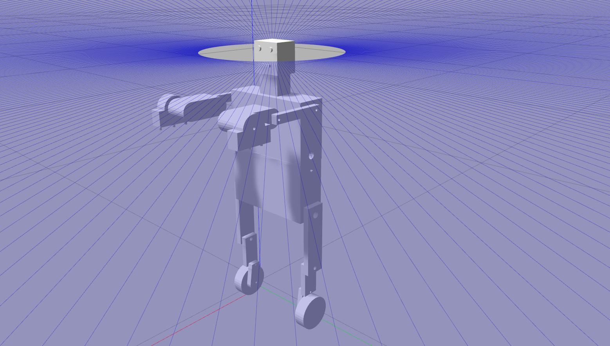

# ENPM 662 - Introduction to Robot Modelling
## Final Exam

### Problem-5: Humanoid Robot [8 pts] 
A humanoid robot with legs equipped with wheels combines the advantages of bipedal locomotion with the efficiency of wheeled movement, creating a versatile and highly functional machine. 

<p align=center>

</p>


## Installation

Create a ros2 workspace:

```
mkdir -p ~/ros2_ws/src
```

Go to the source folder and clone the repository:

```
cd ~/ros2_ws/src
git clone https://github.com/Madhav2133/enpm662_finalexam.git
```

Come to the workspace folder and compile it:

```
cd ~/ros2_ws
colcon build
```

## Usage

You can run the gazebo simulator using:

```
ros2 launch humanoid_robot gazebo.launch.py
```

You can run the rviz and gazebo together using:

```
ros2 launch humanoid_robot debug.launch.py
```

- When you run this, open another terminal and run the following node:

```
ros2 run joint_state_publisher_gui joint_state_publisher_gui
```

<p align=center>

</p>